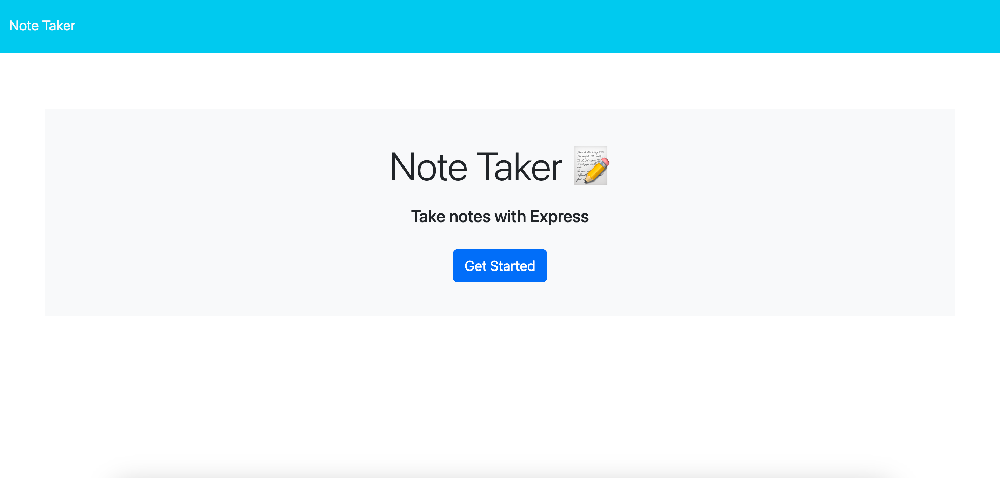
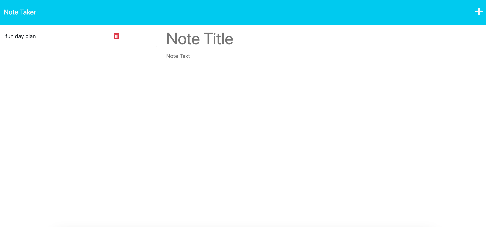

# note-taker-app

## Description

For this project, I wanted to create a note taker application so that people can keep track of the things they need to do in an organized, intuitive, and simple way. Through my time working on this project, I utilized Express.js for the first time in order to create HTML and API routes, including GET, POST, and DELETE requests. Along with this, I used Node.js, Javascript, CSS, and HTML to build the backend and frontend of this application. 

## Usage

To use this application, the user can click the "Get Started" button, which will bring them to a notes page. On the notes page, the user can save new notes, look at past saved notes, and delete notes. To save a note, the user can click the save button icon, which appears when the user begins typing a new note. To look at past saved notes, the user can click on any of the notes on the left-hand side of the page. To write a new note, the user can click the "+" button and to delete a note, the user can click the trashcan button.

[This is the link to the completed application](https://enigmatic-stream-00685.herokuapp.com/)

This is a screenshot to the home page of the completed application:

This is a screenshot to the notes page of the completed application:

## How to Contribute

For information on how to contribute to this project or if you have any advice for me, please email me at elva.rothman.developer@gmail.com!